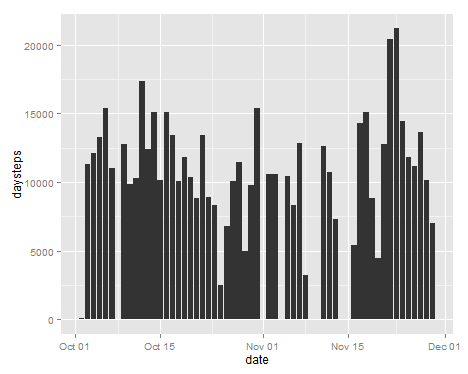
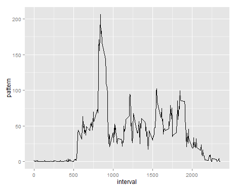
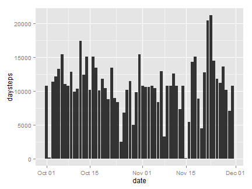
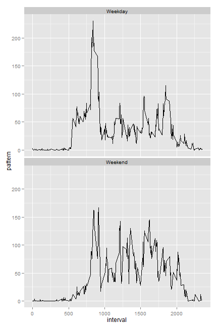

# Reproducible Research: Peer Assessment 1


## Dataset

The data for this assignment:
[Activity monitoring data](https://d396qusza40orc.cloudfront.net/repdata%2Fdata%2Factivity.zip) [52K]


## Loading and preprocessing the data
Data read using read.csv(). 
Transform the "date" column into DateTime class.
Transform the dataframe to data.tablefor conveniency in data manipulation.


```r
activity <- read.csv("activity/activity.csv")
activity$date <- as.Date(activity$date, "%Y-%m-%d")

library(data.table)
activity <- data.table(activity)
```

## What is mean total number of steps taken per day?
Missing values are removed.


```r
daySteps <- activity[complete.cases(activity),
        list(daysteps = sum(steps)), by = date]
```

A histogram of the total number of steps taken each day,using the ggplot2 plotting system.


```r
library(ggplot2, quietly = TRUE)
ggplot(daySteps, aes(x = date, y = daysteps)) + geom_bar(stat = "identity")
```

 

Mean and Median total number of steps taken per day:


```r
mean(daySteps$daysteps, na.rm = TRUE)
```

```
## [1] 10766
```

```r
median(daySteps$daysteps, na.rm = TRUE)
```

```
## [1] 10765
```

## What is the average daily activity pattern?
Missing values are ignored.


```r
activity_pattern <- activity[complete.cases(activity),list(pattern = mean(steps)),
        by = interval]
```


```r
ggplot(activity_pattern, aes(x = interval, y = pattern)) + geom_line()
```

 

Interval that contain the maximum number of steps.


```r
activity_pattern$interval[which.max(activity_pattern$pattern)]
```

```
## [1] 835
```

## Imputing missing values
Compute the total number of rows with missing values `NA`.


```r
sum(!complete.cases(activity))
```

```
## [1] 2304
```

First, I realized that steps is the only variable that has missing values. So we only need to fill in missing valies of this variable. I decided to fill in missing values in dataset using the mean for the 5-minute interval. First I need to make a copy of the original activity. Then I will use data.table assignment by reference and use ifelse function to assign missing values.


```r
activity_naImp <- copy(activity)
activity_naImp <- activity_naImp[,naImpsteps := ifelse(is.na(steps), 
                                                          mean(steps, na.rm = TRUE), steps),
                                             by = interval]
activity_naImp[, steps := NULL]
```

```
##              date interval naImpsteps
##     1: 2012-10-01        0    1.71698
##     2: 2012-10-01        5    0.33962
##     3: 2012-10-01       10    0.13208
##     4: 2012-10-01       15    0.15094
##     5: 2012-10-01       20    0.07547
##    ---                               
## 17564: 2012-11-30     2335    4.69811
## 17565: 2012-11-30     2340    3.30189
## 17566: 2012-11-30     2345    0.64151
## 17567: 2012-11-30     2350    0.22642
## 17568: 2012-11-30     2355    1.07547
```

```r
setnames(activity_naImp, "naImpsteps", "steps")
```

Finally, make the histogram plot and compute the mean and medium.


```r
daySteps_naImp <- activity_naImp[,
                                           list(daysteps = sum(steps)),
                                           by = date
                                           ]
ggplot(daySteps_naImp, aes(x = date, y = daysteps)) + geom_bar(stat = "identity")
```

 

```r
mean(daySteps_naImp$daysteps)
```

```
## [1] 10766
```

```r
median(daySteps_naImp$daysteps)
```

```
## [1] 10766
```


## Are there differences in activity patterns between weekdays and weekends?

First create a new factor variable indicating whether a given day is on weekdays or not. Separately compute the average daily activity patterns for weekday and weelend.


```r
activity_naImp[,
                     is.weekday := ifelse(weekdays(date) %in% c("Saturday", "Sunday"), "Weekend", "Weekday")
                     ]
```

```
##              date interval   steps is.weekday
##     1: 2012-10-01        0 1.71698    Weekday
##     2: 2012-10-01        5 0.33962    Weekday
##     3: 2012-10-01       10 0.13208    Weekday
##     4: 2012-10-01       15 0.15094    Weekday
##     5: 2012-10-01       20 0.07547    Weekday
##    ---                                       
## 17564: 2012-11-30     2335 4.69811    Weekday
## 17565: 2012-11-30     2340 3.30189    Weekday
## 17566: 2012-11-30     2345 0.64151    Weekday
## 17567: 2012-11-30     2350 0.22642    Weekday
## 17568: 2012-11-30     2355 1.07547    Weekday
```

```r
activity_naImp[, is.weekday := as.factor(weekday)]
```

```
## Error: object 'weekday' not found
```

```r
activity_pattern_naImp <- activity_naImp[,
                                                list(pattern = mean(steps)),
                                                by = list(interval, is.weekday)
                                                ]
```

Make two separate activity pattern plot for weekday and weekend.


```r
ggplot(activity_pattern_naImp, aes(x = interval, y = pattern)) + geom_line() + facet_wrap(~ is.weekday, nrow = 2)
```

 
